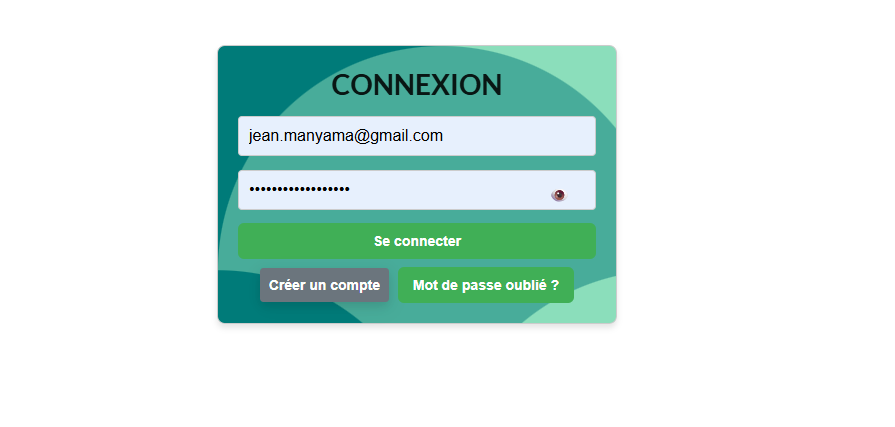
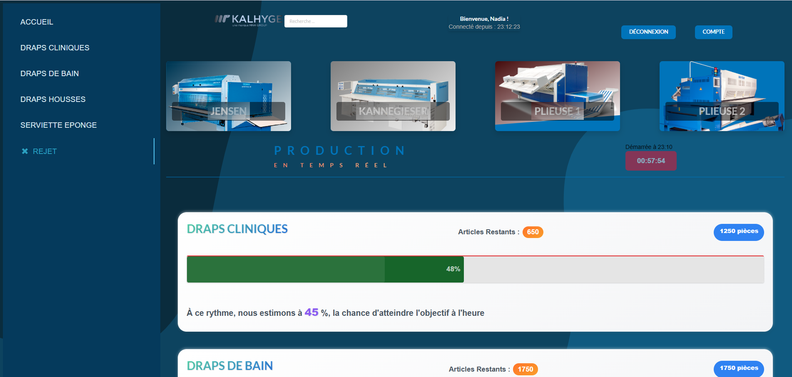
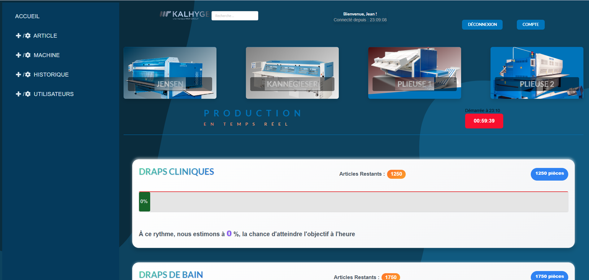

# Kalhyge-Prod – Suivi de production industrielle


Application web permettant le suivi en temps réel de la production en blanchisserie industrielle.
Objectif : remplacer les relevés manuels et améliorer la prise de décision.

## 🚀 Démo en ligne

- 🌐 Frontend : <https://deploy-front-vercel-cd.vercel.app>
- 🔗 API Backend : <https://api-kalhygee.onrender.com>
  
  Test rapide :
  - GET /health → vérifie que l’API est opérationnelle
- 💻 Code Backend : <https://github.com/JeanManyama/kalhyge-prod-backend>

## 🏗️ Architecture globale

Client (React) → API REST (Node.js / Express) → Base de données (PostgreSQL)

Pipeline DevOps :

- CI : GitHub Actions (tests, lint, audit, build)
- CD :
  - Frontend déployé sur Vercel
  - Backend déployé sur Render

👉 “La CI valide le code, le CD le met automatiquement en production.”

## 🛠️ Stack technique

### Frontend

- React
- Vite
- JavaScript (ES6+)

### Backend

- Node.js
- Express

### Base de données

- PostgreSQL

### DevOps

- GitHub Actions (CI/CD)
- Déploiement cloud (Vercel, Render)

### Qualité & Tests

- Biome (lint + format)
- Jest (tests unitaires backend)

## ⚙️ Fonctionnalités principales

- Suivi de production en temps réel
- Authentification utilisateur
- Gestion des données de production

## 🔐 Sécurité

- Rate limiting (protection brute force / spam)
- Validation des données (anti XSS / injections)
- Variables d’environnement sécurisées
- Analyse des dépendances avec npm audit

👉 Approche en couches : sécuriser, ralentir et bloquer les attaques.

## 🔁 CI/CD (Intégration & Déploiement continu)

Pipeline automatisé avec GitHub Actions :

- Installation des dépendances
- Lint & format (Biome)
- Tests automatisés (Jest)
- Audit sécurité (npm audit)
- Build du projet

👉 Si une étape échoue, le déploiement est bloqué.

## 🧪 Tests

Tests unitaires backend avec Jest :

- Validation des données
- Création d’articles
- Gestion des erreurs
- Prévention des doublons

👉 Base de données mockée pour des tests rapides et isolés.

## 📦 Installation locale

```bash
git clone https://github.com/JeanManyama/kalhyge-prod-frontend.git
cd kalhyge-prod-frontend
npm install
npm run dev
```

## 📌 Améliorations futures

- Ajout de tests frontend
- Containerisation avec Docker
- Monitoring (logs, performances, erreurs)

## 👨‍💻 Auteur

Jean Manyama Kapinga

- 📧 <jean.manyama@gmail.com>
- 🔗 <https://github.com/JeanManyama>

## 📸 Aperçu de l’application

### Connexion



### Dashboard de production



### Administration


